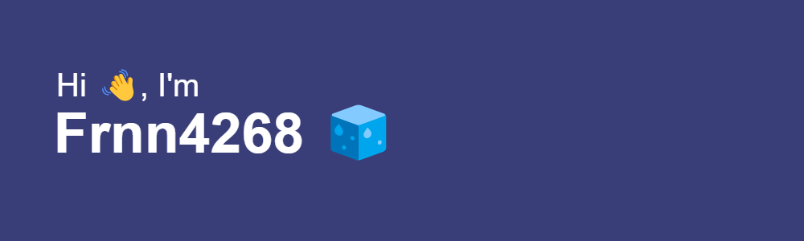

# About me ☕

*I'm Fernando!*

I love building robust and scalable web applications 🕶️.

- I studied Information Systems Engineering and Computer Science at [Mariano Gálvez University of Guatemala](https://www.umg.edu.gt/).
- I loves DevOps culture.
- I love dockerizing anything.
- I really like backend and frontend programming.
- Hobbies: Learn about CI/CD, watch videos, and listening to music.

####* 🪐 Connect with me!*

## 🧃 My Tech Skill Stack

## 📎 GitHub Statistics

|   |   |
| ------------ | ------------ |

|   |   |
| ------------ | ------------ |

---

👋 Thanks for stopping by! Feel free to explore my repositories if you need:

- 🔍 Code Inspiration
- ⚙️ Technical Solutions
- 🤝 Collaboration

Happy coding! 🚀
