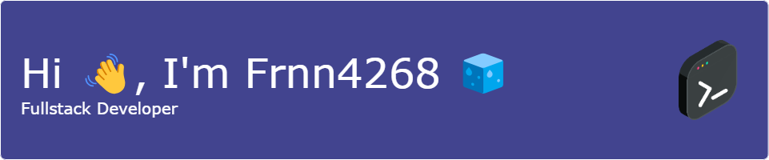

# About me ☕

*I'm Fernando!*

I love building robust and scalable web applications 🕶️.

- I studied Information Systems Engineering and Computer Science at [Mariano Gálvez University of Guatemala](https://www.umg.edu.gt/).
- I loves DevOps culture.
- I love dockerizing anything.
- I really like backend and frontend programming.
- Hobbies: Learn about CI/CD, watch videos, and listening to music.

  

  

## 🧃 My Tech Skill Stack

## 📎 GitHub Statistics

  

    👋 Thanks for stopping by! Feel free to explore my repositories if you need:
  

  

    <a
       style="color: #58a6ff; text-decoration: none; transition: color 0.3s ease;"
       onmouseover="this.style.color='#79c0ff'" 
       onmouseout="this.style.color='#58a6ff'">
      🔍 Code Inspiration
    </a>
    <a
       style="color: #58a6ff; text-decoration: none; transition: color 0.3s ease;"
       onmouseover="this.style.color='#79c0ff'" 
       onmouseout="this.style.color='#58a6ff'">
      ⚙️ Technical Solutions
    </a>
    <a
       style="color: #58a6ff; text-decoration: none; transition: color 0.3s ease;"
       onmouseover="this.style.color='#79c0ff'" 
       onmouseout="this.style.color='#58a6ff'">
      🤝 Collaboration
    </a>
  

  

    Happy coding! 🚀
  

